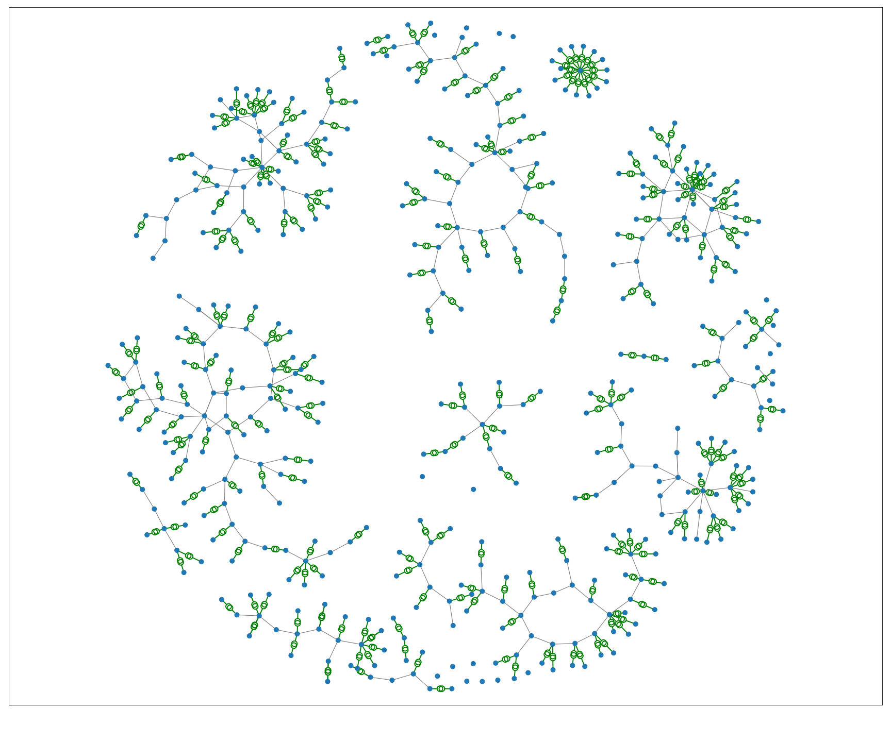

# Bolivian Electrical Power System simulation

This implements a data science analysis to the Bolivian power system. On top of the DS work, we are going to implement a Reinforcement Learning Algorithm for optimcal calculation for power stability and energy generation.

Here is a plot of the whole power circuit.

# TODOS

* Merge with Switches and Auto Trafos
* Merge with Generators