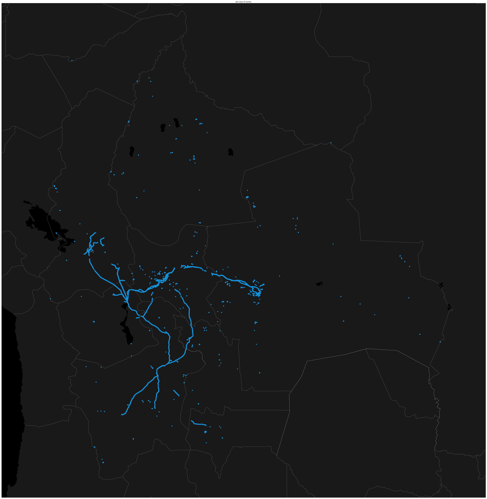

# Bolivian Electrical Power System simulation

The purpose of this proposal is to have a simple and powerfull algorithm based on recent AI techniques, more spesifically Reinforcement Learning, for solve the problem of Smart Grid planning and Fault detection prediction.

For achieve this general objective, the next local objectives are presented
* Data Mining
* Data Analysis
* Algorithm Creation
* Simulation

# Data Mining

There exist two sources of data, the geo data was adquired usign web scraping techniques and the other with external sources.

## Geo Data
In the Data mining side, we use the open street maps source for scrap geo data for get the power lines position and names in the Bolivian territory. The result for this scraping was geo data in the form of a table, the next plot shows the geo data for each transmision line in the Bolivian territory.

## External Sources

External sources of data was adquired for complete the whole circuit simulation. The partial result of the merge with this external is in the next figure, where we join the nodes and transformers for complete the electrical circuit. 

There are yet work to do with the Data Science analysis with the Geo data and the external sources. 

Here is a plot of the whole power circuit, nodes + transformers.

# TODOS

* Merge with Switches and Auto Trafos
* Merge with Generators
* Simple Power Flow simulations